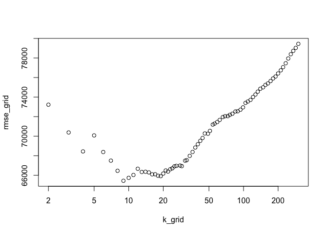

Saratoga Houses
================
Elliot
3/15/2019

Taxing Authority of Saratoga, NY

Many of the town’s local services such as our local schools, public libraries, and emergency services are funded through property taxes. In order to determine the appropriate amount of tax to levy every year, we need to determine the value of your house as well as the property that it occupies.

In order to assess your property’s value, we used several models that included different components and house characteristics.

The following is the set of characteristics along with descriptions:
	lotSize: the amount of land occupied by the property (in acres)
	landValue: the intrinsic value of just the land itself (in dollars)
	waterfrontDummy: determines if the house is set by a waterfront
	centralAirDummy: determines if heating and cooling is delivered centrally
	newConstructionDummy: determines if the house was newly built
	age: the age of the house (in years)
	ageSq: the possibility of changing price behavior of age as it increases
	bedrooms: the number of bedrooms in the house
	bathrooms: the number of bathrooms in the house
	heating: how the house the heated; electric, hot water/steam, or hot air
	livingArea: the amount of usable space in the house (in square feet)
	pctCollege: the percentage of adults in the neighborhood that have a college degree
	valueSqFt: landValue/livingArea to compute an intrinsic $/sq ft output

We evaluate some of these characteristics together -- i.e. we see what effects some of the terms have on each other. For example, having more bathrooms relative to the number of rooms in your house increases the house's valuation. 

In order to predict the value of your house, we evaluated two different styles of models:
	(1)	An independent model using a combination of the characteristics listed above (just to be clear: linear model).
	(2)	The mean price of houses with similar characteristics as yours (just to be clear: KNN). 

A calculation was performed to determine how accurate our models were in predicting house values. Because these models are projections, each method carries a certain amount of error. Our objective is to minimize this error. In doing so, we found that Model 1 carries less error than Model 2. This indicates that Model 1 is a better assessment of your property value so that your property taxes are computed more accurately.

